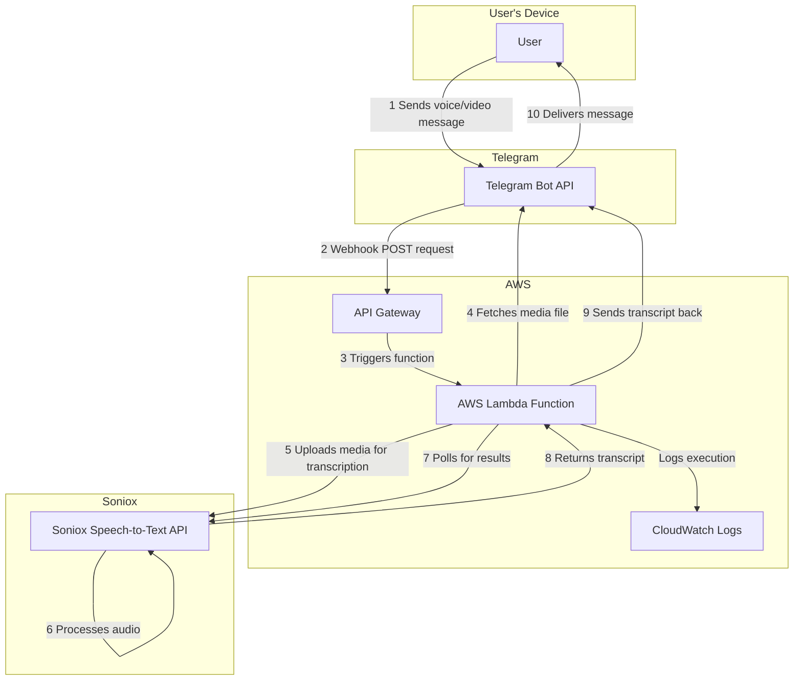

# Serverless Speech-to-Text Telegram Bot

[](https://www.python.org/downloads/release/python-390/)
[](http://www.apache.org/licenses/LICENSE-2.0)
[](https://aws.amazon.com/lambda/)

A production-grade, serverless Telegram bot for fast and accurate speech-to-text transcription. Built on AWS Lambda and powered by the [Soniox API](https://soniox.com/), this bot listens for voice, video, or video note messages and returns a transcription, making it a powerful tool for converting spoken audio to text on the fly.

---

## Table of Contents

- [Architecture](#architecture)
- [Key Features](#key-features)
- [Deployment Guide](#deployment-guide)
  - [Prerequisites](#prerequisites)
  - [Step 1: Create a Telegram Bot](#step-1-create-a-telegram-bot)
  - [Step 2: Get a Soniox API Key](#step-2-get-a-soniox-api-key)
  - [Step 3: Configure Environment Variables](#step-3-configure-environment-variables)
  - [Step 4: Deploy the Lambda Function](#step-4-deploy-the-lambda-function)
  - [Step 5: Set the Telegram Webhook](#step-5-set-the-telegram-webhook)
- [Local Transcription Utility](#local-transcription-utility)
- [Project Structure](#project-structure)
- [Logging and Debugging](#logging-and-debugging)
- [Contributing](#contributing)
- [License](#license)

---

## Architecture

The bot operates on a serverless, event-driven architecture. A user's message to the Telegram bot triggers a webhook to AWS API Gateway, which in turn invokes the core AWS Lambda function. The function handles all business logic: fetching the media file from Telegram, orchestrating the transcription with the Soniox API, and sending the result back to the user.



---

## Key Features

- **High-Accuracy Transcription**: Leverages the Soniox API for state-of-the-art, low-latency speech recognition.
- **Multi-Format Support**: Transcribes Telegram voice messages (`audio/ogg`), video messages (`video/mp4`), and video notes (`video/mp4`).
- **Multi-Language Hints**: Improves accuracy by providing language hints to the transcription model (defaults: `ru`, `uk`, `es`, `en`).
- **Serverless & Scalable**: Built on AWS Lambda for cost-efficiency (pay-per-use) and automatic scaling to handle any workload.
- **Secure & Private**: Implements a user `ALLOW_LIST` to ensure only authorized Telegram usernames can interact with the bot.
- **Asynchronous & Resilient**: Handles transcription requests asynchronously, polling for results without blocking. It includes robust error handling and notifies the user of failures.
- **Automated Resource Cleanup**: Ensures all temporary media files and transcription jobs are deleted from the Soniox service after processing, minimizing storage footprint and cost.
- **Local Transcription Utility**: Comes with `transcribe_local.py`, a helper script to run the same transcription logic on local files.

---

## Deployment Guide

Follow these steps to deploy your own instance of the transcription bot.

### Prerequisites

- An [AWS Account](https://aws.amazon.com/free/) with permissions to create Lambda, API Gateway, and IAM resources.
- [Python 3.8](https://www.python.org/downloads/release/python-380/) or newer installed locally.
- A [Telegram Account](https://telegram.org/).

### Step 1: Create a Telegram Bot

1.  Open Telegram and start a chat with [@BotFather](https://t.me/BotFather).
2.  Send the `/newbot` command and follow the prompts to choose a name and username for your bot.
3.  **BotFather** will provide you with a unique **token**. Save this token—it is your `TELEGRAM_TOKEN`.

### Step 2: Get a Soniox API Key

1.  Sign up for an account at [soniox.com](https://soniox.com/).
2.  Navigate to your account settings or API section to generate an API key.
3.  Save this key—it is your `SONIOX_TOKEN`.

### Step 3: Configure Environment Variables

The Lambda function is configured via environment variables.

| Variable         | Description                                                                                              | Required |
| ---------------- | -------------------------------------------------------------------------------------------------------- | :------: |
| `TELEGRAM_TOKEN` | The token for your Telegram bot from Step 1.                                                             |   **✓**    |
| `SONIOX_TOKEN`   | The API key for the Soniox service from Step 2.                                                          |   **✓**    |
| `ALLOW_LIST`     | A comma-separated list of Telegram usernames authorized to use the bot (e.g., `user1,user2,user3`).        |   **✓**    |

**Security Best Practice**: For a production environment, it is highly recommended to store secrets like API tokens in **AWS Secrets Manager** or **Parameter Store** and grant the Lambda function's IAM role permission to access them.

### Step 4: Deploy the Lambda Function

1.  **Create Lambda Function**:
    -   Go to the AWS console, **Lambda** service and click **Create function**.
    -   Select **Author from scratch**.
    -   **Function name**: `telegram-transcription-bot`
    -   **Runtime**: Python 3.9 (or newer)
    -   **Architecture**: `arm64` for lower cost
    -   Unfold **Additional configurations** and enable **Function URL**.
    -   **Auth type**: **None**
    -   Click **Create function**.

3.  **Upload Code**:
    -   In the **Code source** section, click on lambda_function.py and paste the full content of lambda_function.py file from this repository.
    -   Click on **Deploy** button.

4.  **Configure Settings**:
    -   Go to the **Configuration** tab.
    -   In **Environment variables**, add the three variables from Step 3.
    -   In **General configuration**, you may want to increase the **Timeout** to 30 seconds to accommodate longer transcriptions.
    -   In **Function URL** section, copy the **URL** and save it for the next step.


### Step 5: Set the Telegram Webhook

Tell Telegram where to send message events. Replace `<YOUR_TOKEN>` with your `TELEGRAM_TOKEN` and `<YOUR_API_GATEWAY_URL>` with the endpoint from the previous step. Run this command in your terminal or browser:

```
https://api.telegram.org/bot<YOUR_TOKEN>/setWebhook?url=<YOUR_API_GATEWAY_URL>
```

You should see a `{"ok":true,"result":true,"description":"Webhook was set"}` response. Your bot is now live!

### Step 6: Test the Bot

* Send a text message to your bot. You should receive "You sent text." response back.
* Send a voice, video, or video note message to your bot. You should see the transcription in the chat.

---

## Local Transcription Utility

The repository includes `transcribe_local.py`, a command-line script for transcribing local audio or video files using the same core `transcribe()` function.

### Usage

The script requires the `SONIOX_TOKEN` environment variable to be set.

```bash
# Set the token
export SONIOX_TOKEN="<YOUR_SONIOX_TOKEN>"

# Run transcription
python3 transcribe_local.py path/to/your/file.mp3 -o output/transcript.txt
```

-   The input file is the first argument.
-   The `-o` or `--output` flag is optional and specifies where to save the transcript. If omitted, it saves to `<input_file>.txt`.

---

## Logging and Debugging

All Lambda function logs are sent to **AWS CloudWatch**. You can monitor executions, trace errors, and view `print`/`logging` statements in the log group associated with your Lambda function. Key log events include:
-   Receiving an event.
-   User authorization status.
-   Transcription progress and cleanup actions.
-   Errors during any stage of the process.